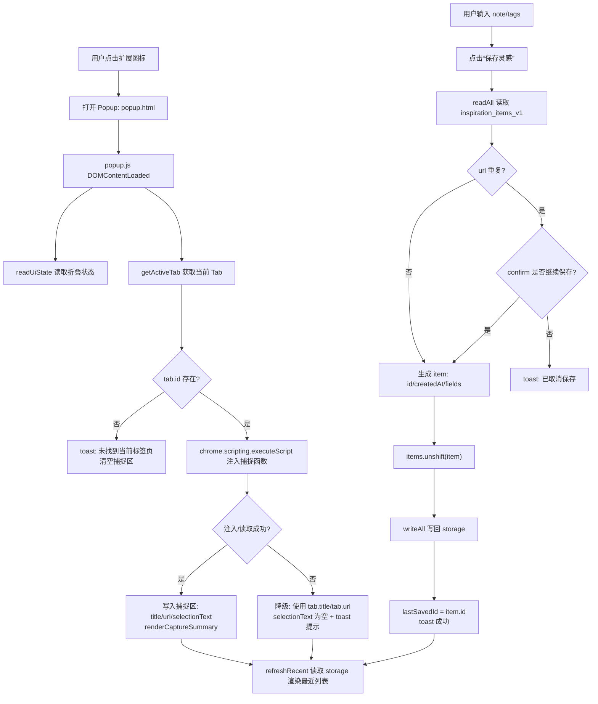
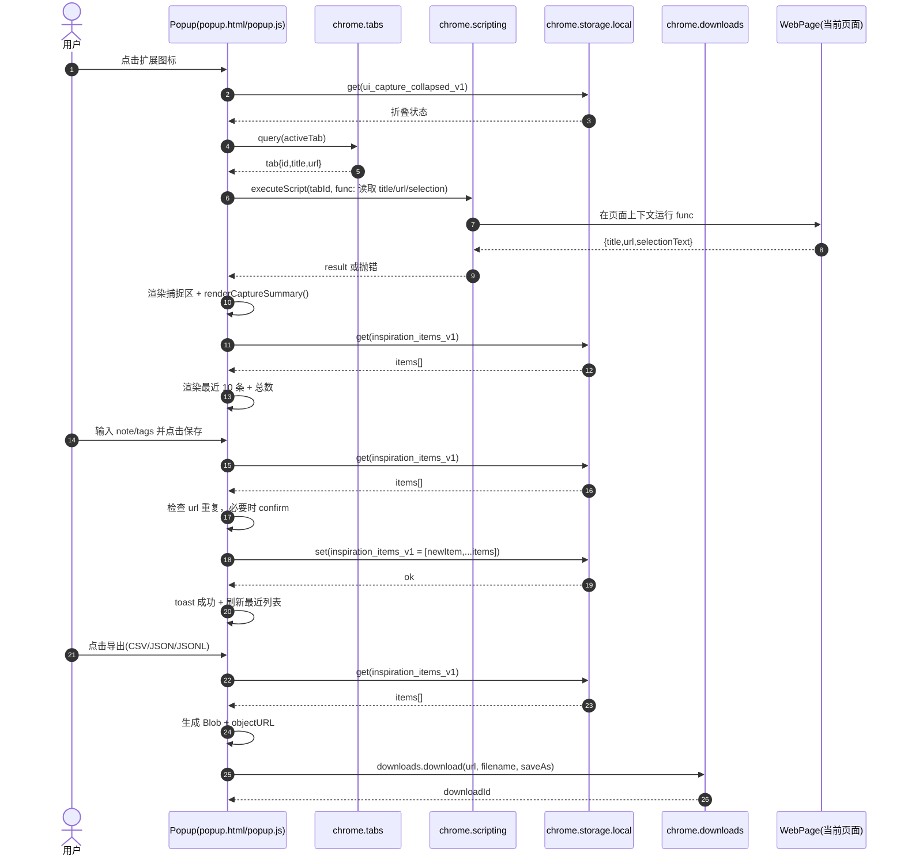

# IdeaSnatch（灵感捕手）技术开发文档

## 1. 文档目标与范围

本文件用于指导 IdeaSnatch（Chrome / Edge 扩展）后续的开发、维护与迭代，覆盖：

- **产品范围**：以 `PRD.md` 与 `README.md` 为准
- **当前实现**：以 `extension/` 目录内源码为准
- **技术边界**：本地存储、导出文件；不含云同步/登录/后端

---

## 2. 产品概述（PRD 关键点落到技术）

用户在浏览网页时点击扩展图标打开 Popup：

- 自动抓取：**页面标题**、**页面 URL**、**当前选中文本**
- 手动补充：**备注**、**标签**（回车添加多个，支持逗号/换行粘贴）
- 一键保存：写入浏览器本地
- 重复链接提醒：同一 URL 已保存过则确认是否继续保存
- 最近记录：Popup 内显示最近 **10** 条与总条数，可点击打开原链接，可删除
- 导出：导出 **CSV / JSON**（并保留 JSONL 作为次要格式）
- UI 体验：捕捉区可折叠、轻量、内容创作者效率工具风格

---

## 3. 技术选型与总体架构

### 3.1 扩展形态

- **Manifest V3**（`extension/manifest.json`）
- **UI**：`action.default_popup`（`extension/popup.html` + `popup.css` + `popup.js`）
- **后台**：`background.service_worker`（`extension/background.js`）

### 3.2 模块划分（代码现状）

- `popup.js`：**所有业务逻辑核心**
  - 抓取页面上下文：通过 `chrome.scripting.executeScript` 在活动 tab 执行函数
  - 读写存储：`chrome.storage.local`
  - 去重提醒、保存、最近列表渲染、删除
  - 标签解析与 chip UI
  - 导出：通过 `chrome.downloads.download` 生成文件
  - UI 折叠状态持久化
- `background.js`：**图标兜底**
  - 使用 `OffscreenCanvas` 动态绘制 icon（当静态 PNG 不存在时设置 `chrome.action.setIcon`）

### 3.3 关键数据流（从点击到落盘）

1. 用户点击扩展图标 -> 打开 `popup.html`
2. `popup.js` `DOMContentLoaded`：
   - 读取 UI 折叠状态（`UI_CAPTURE_COLLAPSED_KEY`）
   - 获取活动 tab（`chrome.tabs.query`）
   - 通过 `chrome.scripting.executeScript` 抓取 `document.title`、`location.href`、`window.getSelection().toString()`
3. 用户补充 note/tags -> 点击保存：
   - 从 `chrome.storage.local` 取出全量 items
   - 若 URL 重复：`confirm` 提示是否继续
   - 新记录 `unshift` 到数组头部并整体写回
4. 刷新最近列表：取全量 items -> 渲染前 10 条 + 显示总数

补充：用图表示关键链路（Mermaid）。

**流程图（Popup 打开 → 捕捉 → 保存/去重 → 列表刷新）**

**时序图（打开 Popup 与保存）**

---

## 4. 目录结构与入口文件

当前仓库中与扩展直接相关的结构（核心）：

- `extension/manifest.json`：扩展配置与权限
- `extension/popup.html`：Popup UI 结构
- `extension/popup.css`：Popup 样式
- `extension/popup.js`：Popup 业务逻辑（主要开发点）
- `extension/background.js`：Service Worker（主要用于 icon fallback）
- `extension/_locales/*/messages.json`：i18n 文案（`zh_CN`、`en`）
- `extension/icons/icon-source.svg`：图标源文件（注意：manifest 引用的 PNG 需要存在或走 fallback）

---

## 5. Manifest 与权限设计（MV3）

`extension/manifest.json` 关键配置：

- **manifest_version**：3
- **action.default_popup**：`popup.html`
- **background.service_worker**：`background.js`
- **permissions**：
  - `storage`：本地持久化灵感数据与 UI 状态
  - `activeTab`：允许对当前活动页面进行有限访问（配合 `scripting`）
  - `scripting`：在当前 tab 执行脚本以抓取选中文本/标题/URL
  - `downloads`：导出 CSV/JSON/JSONL 文件
- **minimum_chrome_version**：114（保证 MV3 与部分 API 行为稳定）

安全与合规说明：

- 当前实现仅在用户打开 Popup 时抓取一次页面上下文（标题/URL/选区文本），不做持续监听
- 不上传到远端；数据仅在 `chrome.storage.local` 与用户导出文件中存在

---

## 6. 数据模型与存储方案

### 6.1 存储位置

- 使用 `chrome.storage.local`
- 采用单 key 存整表（数组）策略：
  - 数据：`STORAGE_KEY = "inspiration_items_v1"`
  - UI：`UI_CAPTURE_COLLAPSED_KEY = "ui_capture_collapsed_v1"`

### 6.2 记录结构（当前实现）

每条灵感记录字段（`popup.js` 保存对象）：

- `id`: string（`miniId()` 生成，形如 `${timeBase36}_${random}`）
- `createdAt`: string（ISO 时间）
- `title`: string
- `url`: string
- `selectionText`: string
- `note`: string
- `tags`: string[]（去重、截断、上限控制）
- `source`: `"popup"`
- `version`: number（当前为 `1`）

### 6.3 读取/写入策略与复杂度

- **读全量**：`readAll()` -> 从 local storage 取数组
- **写全量**：`writeAll(items)` -> 整体写回
- 当前规模假设：个人效率工具，数据量通常不大；若未来增长到万级以上，应升级为：
  - 分片存储（按月/按 id 前缀）
  - 或使用 `chrome.storage.local` 的对象 map（id -> item）+ 单独维护索引

### 6.4 去重策略（URL 维度）

- 保存前统计 `items.filter(x => x.url === url).length`
- 当 `dupCount > 0` 时弹 `confirm`：允许继续保存新记录（保留历史多次捕捉）

---

## 7. 页面上下文捕捉（标题/URL/选区）

### 7.1 捕捉方式

`popup.js` 使用：

- `chrome.tabs.query({ active: true, currentWindow: true })` 获取活动 tab
- `chrome.scripting.executeScript({ target: { tabId }, func: () => ({ ... }) })` 在页面上下文执行：
  - `document.title`
  - `location.href`
  - `window.getSelection?.().toString()`

### 7.2 失败与降级

部分页面无法注入脚本或读取选区（如浏览器内置页、扩展商店、受限页面）：

- 捕捉失败时 fallback 到 tab 自带的 `tab.title` / `tab.url`
- `selectionText` 置空，并在 toast 给出提示

---

## 8. Popup UI 与交互设计（实现视角）

### 8.1 UI 组成

`popup.html` 主要区块：

- 顶部：品牌 + 导出按钮（CSV/JSON/JSONL，Excel 兼容导出按钮默认 `hidden`）
- 捕捉信息：`
` 折叠区
  - 标题、链接、选中文本
  - 摘要行 `captureSummary`：用于折叠状态下的快速信息
- 编辑区：备注 textarea + 标签 input + chip 列表
- 操作按钮：保存、清空
- toast：提示保存、删除、导出、错误
- 最近保存列表：展示前 10 条 + 总数，支持点击打开链接与删除

### 8.2 折叠状态持久化

`
` 的 open/close 状态会写入：

- key：`ui_capture_collapsed_v1`
- 默认：折叠（存储中未显式为 `false` 时视为折叠）

### 8.3 标签输入规则（解析/去重/限制）

- 输入来源：
  - 回车：将当前 input 解析并入 tags
  - 输入中出现逗号/中文逗号/换行：实时拆分并吸收已完成部分
  - blur：离开焦点时吸收剩余内容
- 归一化：
  - 多空格压缩、trim
  - 单 tag 最长 24 字符
- 去重与数量限制：
  - 去重保持顺序
  - 最多 12 个标签

---

## 9. 导出设计（CSV / JSON / JSONL / Excel 兼容）

### 9.1 导出入口

Popup 顶部按钮触发 `exportAll(format)`：

- `json`：数组 JSON（pretty print）
- `jsonl`：一行一个 JSON object（NDJSON）
- `csv`：UTF-8 + BOM + CRLF（提升 Excel 识别）
- `excel`（TSV）：UTF-16LE + BOM（跨 Windows/macOS 更稳）；当前按钮在 UI 中 `hidden`

### 9.2 文件命名

- 格式：`灵感捕手_YYYYMMDD_HHMM.<ext>`
- 使用 `chrome.downloads.download({ saveAs: true })` 让用户选择保存位置

### 9.3 字段映射

导出字段与顺序（与 README 描述一致）：

- `createdAt`, `title`, `url`, `selectionText`, `note`, `tags`

其中 `tags`：

- CSV/TSV 中以 `" | "` 拼接
- JSON/JSONL 保持数组

---

## 10. 最近记录列表（渲染/交互）

### 10.1 展示规则

- 列表渲染使用全量 items 的 `slice(0, 10)`
- 标题显示总数：`最近保存（最新 10 条 / 共 X 条）`

### 10.2 点击行为

- 点击条目：`chrome.tabs.create({ url: it.url, index: currentTab.index + 1 })`
- 删除按钮：
  - `stopPropagation()` 避免触发打开链接
  - `confirm` 二次确认
  - 删除后刷新列表并 toast 提示

---

## 11. 国际化（i18n）

`manifest.json` 使用 `__MSG_*__`：

- `default_locale`: `zh_CN`
- 文案文件：
  - `extension/_locales/zh_CN/messages.json`
  - `extension/_locales/en/messages.json`

当前 i18n 仅覆盖扩展名称/描述/Action 标题；Popup 内文案为中文硬编码（可作为后续迭代项统一 i18n 化）。

---

## 12. 图标与资源策略

### 12.1 现状

- manifest 引用：`icons/icon16.png`, `icons/icon48.png`, `icons/icon128.png`
- 仓库中目前可见：`icons/icon-source.svg`

### 12.2 fallback 机制（当前实现）

`background.js` 会在启动/安装时尝试 fetch `icons/icon16.png`：

- 若 PNG 存在：不处理（使用 manifest 的静态图标）
- 若不存在：通过 `OffscreenCanvas` 绘制多尺寸 icon，并调用 `chrome.action.setIcon`

建议：

- 若准备上架商店，仍应补齐 PNG 资源，避免不同浏览器对动态 icon 行为差异带来风险。

---

## 13. 安装、构建与发布

### 13.1 本地安装（开发者模式）

源码目录是 `extension/`，在浏览器扩展管理页选择“加载已解压的扩展程序”并指向该目录。

### 13.2 打包发布（建议流程）

当前项目不依赖构建工具，可直接打包 `extension/`：

- 需要包含：`manifest.json`、`popup.html/css/js`、`background.js`、`_locales/`、`icons/`（PNG 建议补齐）
- 产物：将 `extension/` 目录压缩为 zip（用于分发或商店上传）

### 13.3 版本策略

- `manifest.json.version`：遵循语义化（建议）
  - `0.x`：快速迭代期
  - `1.0.0`：功能稳定并准备公开分发

---

## 14. 测试方案（工程视角）

### 14.1 手动回归（与 README 对齐）

核心路径：

- **捕捉**：无选区/有选区/换页后捕捉变化/受限页降级提示
- **折叠**：默认折叠、展开/收起、关闭 Popup 后状态保持
- **保存**：保存后列表更新、关闭再打开仍存在
- **去重**：同一 URL 多次保存弹确认
- **删除**：删除确认、总数减少、列表更新
- **导出**：CSV/JSON/JSONL 导出文件字段正确、中文不乱码

### 14.2 风险用例

- 超长选中文本（滚动/渲染/导出）
- 特殊字符（逗号、引号、换行）在 CSV 中的转义
- tags 输入粘贴多行、多分隔符混用
- `chrome.storage.local` 容量/性能边界（大量数据时 Popup 打开速度）

---

## 15. 已知限制与后续迭代建议（可选）

### 15.1 已知限制（当前实现/浏览器约束）

- 受限页面无法注入脚本读取选区（仅能拿到 tab 标题/URL）
- 采用“全量数组读写”方案，数据量很大时会影响打开 Popup 的响应
- Popup 文案未完全 i18n 化

### 15.2 推荐迭代方向（按性价比排序）

- **补齐静态 PNG 图标**（16/48/128）用于商店分发与一致性
- **搜索/过滤**：按标签/关键词过滤最近记录
- **编辑能力**：对已保存记录可编辑 note/tags
- **数据结构升级**：由数组改为索引化存储以支持更大规模
- **权限最小化审计**：若未来不需要注入脚本，可评估降低权限（例如用 content script + message 方式替代）

---

## 16. 关键实现点索引（便于开发者定位）

- **Manifest**：`extension/manifest.json`
- **页面上下文捕捉**：`extension/popup.js` 的 `capturePageContext()`
- **存储读写**：`readAll()` / `writeAll()`
- **保存与去重提醒**：`handleSave()`
- **最近列表渲染**：`renderRecent()` / `refreshRecent()`
- **导出**：`exportAll(format)`
- **折叠状态**：`readUiState()` / `writeUiState()` / `
`
- **动态 icon fallback**：`extension/background.js`

